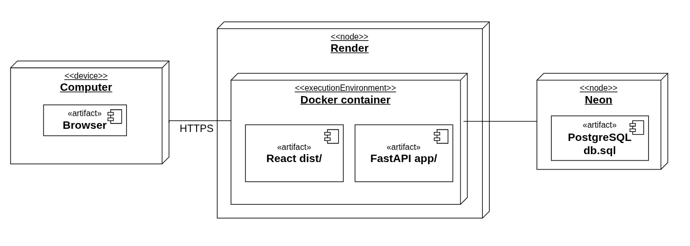
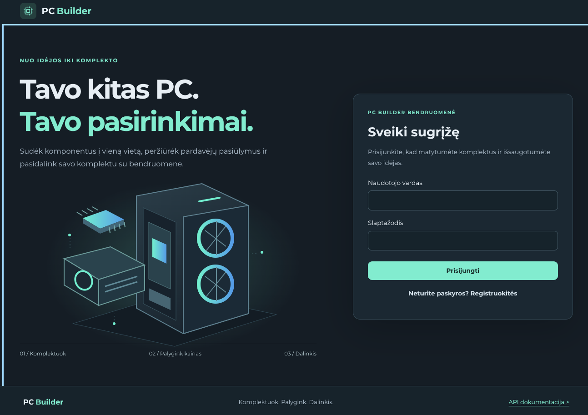
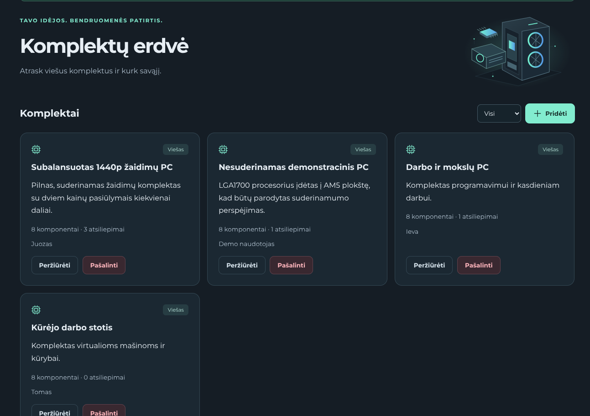
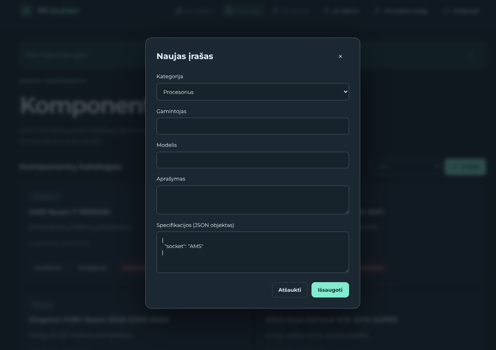

# PC Builder projekto ataskaita

**Studijų dalykas:** T120B165 Saityno taikomųjų programų projektavimas<br>
**Studentas:** Juozas Petryla, IFF-3/10<br>
**Dėstytojai:** prof. Tomas Blažauskas, dėst. Patrikas Armalis<br>
**Kaunas, 2026**

## Turinys

1. [Sprendžiamo uždavinio aprašymas](#1-sprendžiamo-uždavinio-aprašymas)
2. [Sistemos architektūra](#2-sistemos-architektūra)
3. [Naudotojo sąsaja](#3-naudotojo-sąsaja)
4. [API specifikacija](#4-api-specifikacija)
5. [Išvados](#5-išvados)

## 1. Sprendžiamo uždavinio aprašymas

### 1.1. Sistemos paskirtis

PC Builder skirta kompiuterio komplektams sudaryti ir jais dalytis. Administratorius tvarko bendrą kompiuterio dalių katalogą ir pardavėjų pasiūlymus. Prisijungęs naudotojas sukuria komplektą, pasirenka jame jau esančius katalogo komponentus, peržiūri kainų pasiūlymus, gali komplektą paskelbti viešai ir palikti atsiliepimų apie matomus komplektus. [pc-builder](https://pc-builder-ae0g.onrender.com/)

### 1.2. Funkciniai reikalavimai

**Prisijungęs naudotojas (`user`) gali:**

1. Registruotis, prisijungti, atnaujinti sesiją ir atsijungti;
2. Peržiūrėti bendrą komponentų katalogą ir viešus komplektus;
3. Kurti, peržiūrėti, redaguoti ir šalinti savo komplektus;
4. Į komplektą įtraukti, pakeisti arba pašalinti jau kataloge esantį komponentą;
5. Peržiūrėti komponentų pardavėjų pasiūlymus;
6. Palikti, peržiūrėti, redaguoti ir šalinti atsiliepimus matomuose komplektuose;
7. Viešinti savo komplektą, padaryti jį privatų ir kopijuoti jo nuorodą.

**Moderatorius (`moderator`) papildomai gali** šalinti svetimus viešus komplektus ir jų atsiliepimus.

**Administratorius (`admin`) papildomai gali** kurti, peržiūrėti, redaguoti ir šalinti bendro katalogo komponentus bei pardavėjų pasiūlymus, tvarkyti naudotojų paskyras, jų blokavimą ir roles.

Naudotojas negali pasiekti svetimo privataus komplekto ar keisti svetimo komplekto ir atsiliepimo. Katalogo įrašai bendri: administratoriaus pakeista specifikacija ar kaina matoma visuose tą įrašą naudojančiuose komplektuose.

## 2. Sistemos architektūra

Klientinė dalis sukurta naudojant React ir Vite. Serverio dalis – Python FastAPI REST API. Duomenų prieigai naudojamas SQLAlchemy, o duomenys saugomi PostgreSQL. Lokali aplinka ir testai paleidžiami Docker Compose. API pateikia JSON atsakymus ir OpenAPI dokumentaciją.

Autentifikacijai naudojami JWT access žetonai ir atskiri refresh žetonai. Access žetone yra naudotojo ID ir rolė. Access žetono galiojimo laikas – 15 minučių, refresh sesijos – 7 dienos. Refresh žetonas rotuojamas jį panaudojus, o atsijungimas panaikina sesijos galiojimą.

Pagrindiniai domeno ryšiai:

```text
Build → Component pasirinkimas → CatalogComponent → RetailOffer
   └── Review
```

`Build` yra naudotojo komplektas, `Component` – į jį įtrauktas pasirinkimas, `CatalogComponent` – bendra katalogo dalis, o `RetailOffer` – jos pardavėjo pasiūlymas.

### 2.1. Diegimo diagrama



Render Docker servisas pateikia naudotojo sąsają ir API, o Neon teikia PostgreSQL duomenų bazę.

## 3. Naudotojo sąsaja

Sąsaja leidžia registruotis ir prisijungti, tvarkyti komplektus, rinktis katalogo komponentus, peržiūrėti pasiūlymus ir atsiliepimus. Administratoriaus meniu papildomai pateikiamas katalogo ir naudotojų valdymas. Įrašų kūrimo, keitimo ir šalinimo formos pateikiamos modaliniuose languose; veiksmo būsenos ir klaidos rodomos pačioje sąsajoje.

### 3.1. Realizuotos sąsajos ekrano vaizdai







## 4. API specifikacija

API bazinis kelias yra `/api/v1`. Skaitoma OpenAPI specifikacija pateikta [`api/openapi.json`](api/openapi.json), o vietinėje aplinkoje Swagger sąsaja pasiekiama adresu `/api/docs`. API operacijos apima autentifikaciją, komplektus, komplekto komponentų pasirinkimus, bendrą katalogą, pardavėjų pasiūlymus, atsiliepimus ir administruojamas naudotojų paskyras.

Specifikacijoje aprašyti API keliai, įvesties schemos ir operacijų atsako kodai. Joje dar nėra pilnų užklausos ir atsakymo pavyzdžių kiekvienai operacijai.

## 5. Išvados

1. Sukurta React ir FastAPI sistema, kuri leidžia prisijungusiems naudotojams sudaryti komplektus iš administratoriaus tvarkomo bendro komponentų katalogo.
2. API įgyvendintos komplektų, komponentų pasirinkimų, pasiūlymų, katalogo, atsiliepimų ir naudotojų paskyrų operacijos.
3. JWT sesijų atnaujinimas, vaidmenimis paremti leidimai leidžia atskirti naudotojų, moderatorių ir administratorių veiksmus.
4. Prisitaikanti sąsaja suteikia modalines formas, veiksmų grįžtamąjį ryšį ir mobilią navigaciją.
5. Publikavimui paruoštos Render ir Neon konfigūracijos.
